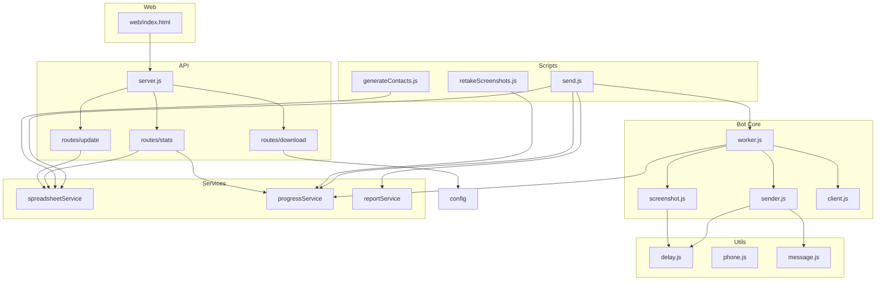
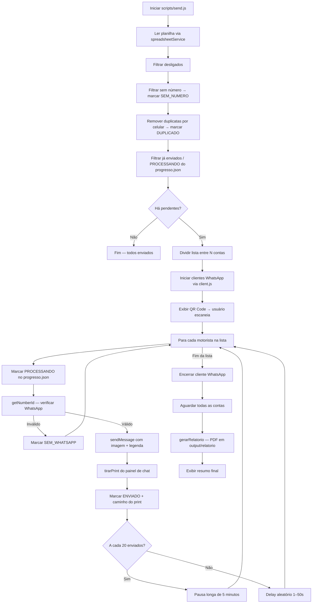
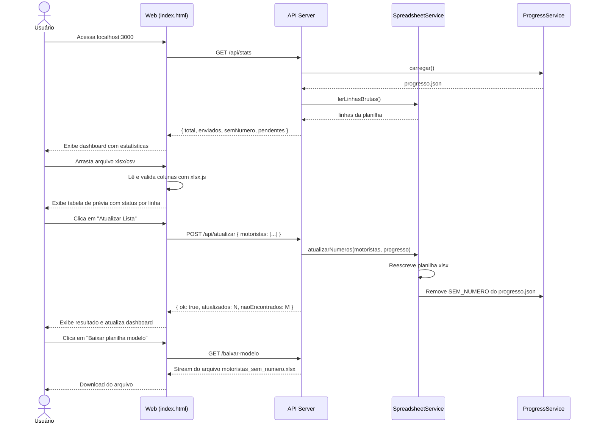

# Arquitetura do Catedral Bot

## 1. Arquitetura Geral



## 2. Fluxo do Bot (send.js)



## 3. Fluxo da Interface Web



## 4. Estrutura de Diretórios

```
INFORMATIVO DE TEMPO DE PARADA/
├── src/
│   ├── config/
│   │   └── index.js          ← Todas as constantes centralizadas
│   ├── bot/
│   │   ├── client.js         ← Fábrica do cliente WhatsApp
│   │   ├── screenshot.js     ← Captura de tela do chat
│   │   ├── sender.js         ← Envio de mensagem + verificação
│   │   └── worker.js         ← Loop principal de uma conta
│   ├── services/
│   │   ├── progressService.js   ← CRUD do progresso.json
│   │   ├── reportService.js     ← Geração de PDF
│   │   └── spreadsheetService.js← Leitura/escrita da planilha
│   ├── utils/
│   │   ├── delay.js          ← sleep, aleatorio, delayAleatorio
│   │   ├── message.js        ← Texto da mensagem WhatsApp
│   │   └── phone.js          ← Normalização de números
│   └── api/
│       ├── server.js         ← Servidor HTTP
│       └── routes/
│           ├── stats.js      ← GET /api/stats
│           ├── update.js     ← POST /api/atualizar
│           └── download.js   ← GET /baixar-modelo
├── web/
│   └── index.html            ← Interface web completa (SPA)
├── scripts/
│   ├── send.js               ← Ponto de entrada do bot
│   ├── retakeScreenshots.js  ← Retirar prints pendentes
│   └── generateContacts.js  ← Gerar VCF de contatos
├── docs/
│   ├── ARCHITECTURE.md       ← Este arquivo
│   ├── API.md                ← Documentação das rotas HTTP
│   └── CHANGELOG-REFATORACAO.md
├── output/
│   ├── prints/               ← Screenshots de confirmação
│   ├── relatorio/            ← PDFs de relatório
│   └── contatos/             ← Arquivos VCF
├── bot/                      ← Código legado (mantido para referência)
├── interface/                ← Interface legada (mantida para referência)
├── package.json
├── .eslintrc.js
├── .prettierrc
├── .editorconfig
└── README.md
```
