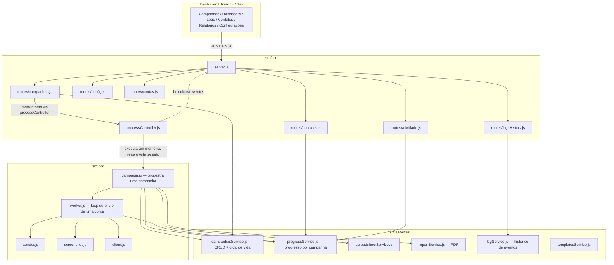
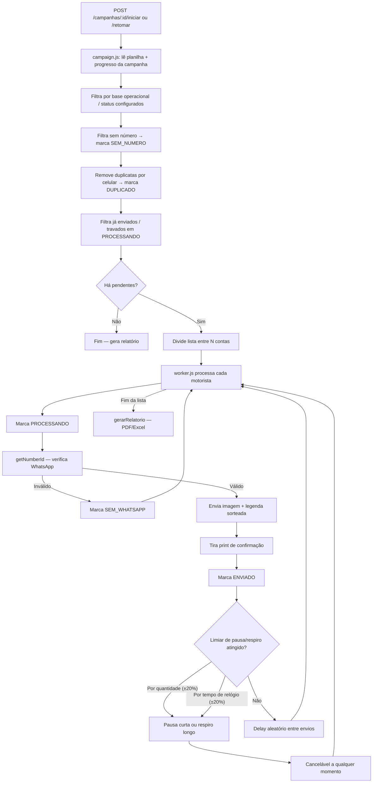
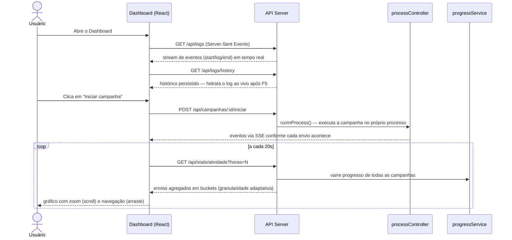

# Arquitetura do Catedral Bot

## 1. Arquitetura Geral



**Ponto-chave:** iniciar/retomar uma campanha não abre um processo `node` separado — `runInProcess()` (`processController.js`) roda `executarCampanha()` dentro do próprio processo do servidor, para poder reaproveitar uma sessão WhatsApp já autenticada em memória (ex: conectada via painel em Configurações). Abrir um subprocesso novo criaria um segundo Chromium apontando pra mesma pasta de sessão, o que o Puppeteer rejeita.

## 2. Fluxo de uma Campanha (`campaign.js` → `worker.js`)



Cada registro de progresso vive em `progresso/<campanhaId>.json` — isolado por campanha. Isso elimina a necessidade de "resetar" um arquivo global entre campanhas e evita que pausar uma campanha enquanto outra roda (ou um encerramento abrupto) corrompa o progresso de qualquer uma delas.

## 3. Painel em Tempo Real (SSE + Analytics)



## 4. Estrutura de Diretórios

```
INFORMATIVO DE TEMPO DE PARADA/
├── src/
│   ├── config/
│   │   └── index.js              ← Constantes e caminhos centralizados
│   ├── bot/
│   │   ├── campaign.js           ← Orquestra o envio de uma campanha inteira
│   │   ├── worker.js             ← Loop de envio de uma conta (pausas, respiro, delay)
│   │   ├── client.js             ← Fábrica do cliente WhatsApp
│   │   ├── screenshot.js         ← Captura de tela do chat
│   │   └── sender.js             ← Envio de mensagem + verificação de número
│   ├── services/
│   │   ├── campanhasService.js   ← CRUD e ciclo de vida das campanhas
│   │   ├── progressService.js    ← Progresso isolado por campanha
│   │   ├── reportService.js      ← Geração de PDF
│   │   ├── spreadsheetService.js ← Leitura/escrita da planilha
│   │   ├── logService.js         ← Histórico de eventos (para o painel de Logs)
│   │   └── templatesService.js   ← Pools de CTA/rodapé
│   ├── utils/
│   │   ├── delay.js              ← sleep cancelável, variação ±20%, delay aleatório
│   │   ├── message.js            ← Montagem da mensagem (padrão + customizada por campanha)
│   │   └── phone.js              ← Normalização de números
│   └── api/
│       ├── server.js             ← Servidor HTTP + SSE
│       ├── processController.js  ← Execução em memória / subprocesso + eventos
│       └── routes/                ← campanhas, contatos, config, contas, atividade, logs, relatório
├── frontend/                     ← Dashboard React (Vite + TypeScript + TanStack Query + Recharts)
├── scripts/
│   ├── send.js                   ← Ponto de entrada do bot (CLI)
│   ├── retakeScreenshots.js
│   └── generateContacts.js
├── docs/
│   ├── ARCHITECTURE.md           ← Este arquivo
│   ├── API.md                    ← Documentação das rotas HTTP
│   └── CHANGELOG-REFATORACAO.md
├── output/                       ← prints/, relatorio/, contatos/ (gerados)
├── progresso/                    ← Um arquivo de progresso por campanha (gerado)
├── campanhas_imagens/            ← Imagens customizadas por campanha (geradas)
├── campanhas.json                ← Estado das campanhas (gerado)
└── package.json
```
